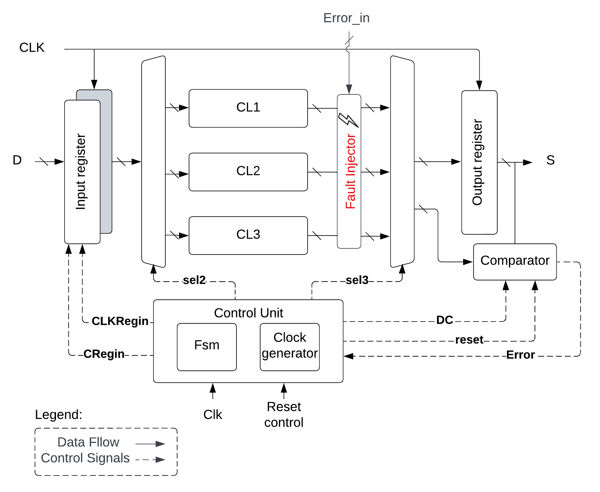

# Implementation of a Hybrid Fault-Tolerant Architecture in Hardware Description Language (VHDL)

## Overview

This project aims to implement a Hybrid Fault-Tolerant Architecture using hardware description language (HDL). The architecture is designed to withstand various types of faults, including transient and permanent faults, ensuring the reliability and robustness of the system.

## Implementation

In this project, we implemented the architecture proposed by Tran (2011) using hardware description language (HDL). Below are some key details of the implementation:

- **Architecture Design**: We followed the architectural design described in Tran's thesis, incorporating fault detection mechanisms and fault recovery strategies.

- **Fault Injection**: We conducted fault injection experiments to evaluate the robustness of the architecture under various fault conditions. An example of a fault injection setup is shown below:

  

- **Principal Architecture Representation**: The architecture is represented in the `src/principal.vhd` file code. This file serves as the main implementation of the fault-tolerant architecture.

- **Simulation File Test Bench**: The simulation file test bench is `sim/principal_tb.vhd`, which is used for testing and verification of the implemented architecture.

- **Performance Evaluation**: We performed performance evaluation tests to assess the effectiveness of the fault-tolerant mechanisms in the architecture.

## Features

- Implementation of fault detection mechanisms
- Integration of fault recovery strategies
- Utilization of redundancy techniques for fault tolerance
- Performance evaluation under fault conditions
- Scalability and flexibility in fault handling

## Technologies Used

- Hardware Description Language (VHDL)
- Simulation tools: Xilinx Vivado

## References

- Tran, Duc Anh. (2011). *A Hybrid Fault Tolerant Architecture for Robustness Improvement of Digital Circuits.* [DOI: 10.1109/ats.2011.89](https://doi.org/10.1109/ats.2011.89)
